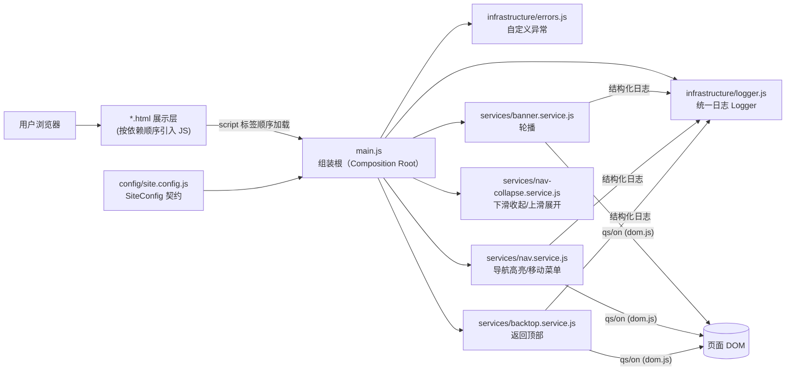

# Phase 1 · 架构设计与接口契约（前端门户，历史文档）

> **说明**：本文档记录的是**前端门户**（纯静态阶段）的架构与契约，内容仍然有效；
> 全站总体架构（服务器部署、后端 API、演进路线）以 [ARCHITECTURE.md](ARCHITECTURE.md) 为准。

> 依据 `agent.md` Rule 3「契约先行两阶段法」产出。Phase 2 仅在本文档获得确认后启动。

## 1. 架构定位与数据流

### 1.1 系统定位

本项目为**清华大学水木书院学生科学技术协会官网**，纯静态站点（HTML/CSS/JS，零构建依赖），内容架构参照电子系科协文档站（eesast/docs），视觉与语言风格严格遵循水木书院官网（smc.tsinghua.edu.cn，清华紫 `#660874`（PANTONE 259C）+ 渐变辅助玫红 `#D93379`）。

站点定位为「展示 + 导航」型门户：首页承担书院门户式版面（横幅、简介、六大技术板块、新闻/公告），七个板块页为占位页，内容后续由科协成员补充。

### 1.2 分层映射（Rule 2 对静态站点的适配）

| 分层 | 本项目载体 | 职责 |
| :--- | :--- | :--- |
| 展示层 Presentation | `*.html` + `assets/css/*` | 页面结构、视觉样式，零业务逻辑 |
| 业务行为层 Service | `assets/js/services/*` | 页面交互行为（轮播、导航状态、返回顶部） |
| 基础设施层 Infrastructure | `assets/js/infrastructure/*` | 横切能力：统一日志、DOM 查询/事件工具、自定义错误 |
| 配置层 Config | `assets/js/config/site.config.js` | 站点唯一配置源（零硬编码：轮播间隔、日志级别等经此注入） |

### 1.3 核心数据流



模块通信约定：使用经典 `<script>`（兼容 `file://` 直开），各模块挂载于单一全局命名空间 `window.SMSK`（水木科协 Shuimu Science & technology assoCiation）；服务一律为**工厂函数**，依赖经参数注入（DI），禁止服务内部读取全局配置。

## 2. 模块目录结构

```
shuimu-web/
├── agent.md                       # 主协议（用户维护）
├── README.md                      # 项目说明与内容补充指南
├── docs/
│   └── PHASE1-架构设计.md          # 本文档
├── tests/
│   └── selftest.html              # 纯函数轻量自测页（浏览器原生断言，零依赖）
└── site/                          # 站点部署单元（重构后：页面与资源统一收拢于此）
    ├── index.html                 # 首页（书院门户式版面）
    ├── data/banners.js            # 数据层：首页轮播内容（管理员维护入口）
    ├── about/index.html           # 科协介绍 About（占位页）
    ├── languages/index.html       # 编程语言 Languages（占位页）
    ├── tools/index.html           # 开发工具 Tools（占位页）
    ├── game/index.html            # 游戏开发 Game（占位页）
    ├── web/index.html             # Web 开发 Web（占位页）
    ├── machine-learning/index.html# 机器学习 Machine Learning（占位页）
    ├── contests/index.html        # 科创竞赛 Contests（占位页）
    └── assets/                    # 全站共享资源（板块私有资源放各板块文件夹）
        ├── css/                   # 样式层（按职责物理拆分，单文件 ≤250 行核心代码）
        │   ├── base.css           #   设计令牌（CSS 变量）+ reset + 通用组件
        │   ├── layout.css         #   顶栏/页头/主导航/移动端抽屉
        │   ├── footer.css         #   页脚四栏/版权条/返回顶部
        │   ├── home.css           #   首页：轮播横幅
        │   ├── home-about.css     #   首页：科协简介与统计卡
        │   ├── home-tech.css      #   首页：技术板块六宫格
        │   ├── home-news.css      #   首页：新闻/通知双栏面板
        │   └── subpage.css        #   子页：page-banner/占位卡片/主题标签
        └── js/
            ├── config/
            │   └── site.config.js     # 配置层：SiteConfig 契约唯一实现
            ├── infrastructure/
            │   ├── logger.js          # 统一日志器（级别语义，替代 console.log）
            │   ├── dom.js             # DOM 查询/事件绑定工具（纯函数）
            │   └── errors.js          # 自定义异常（ConfigError/DomError）
            ├── services/
            │   ├── banner.service.js  # 首页轮播（含索引纯函数，可自测）
            │   ├── nav.service.js     # 当前页高亮 + 移动端抽屉菜单
            │   ├── nav-collapse.service.js # 下滑收起/上滑展开（时长经配置注入）
            │   └── backtop.service.js # 返回顶部（显隐阈值经配置注入）
            └── main.js                # 组装根：读配置 → 建 Logger → 装配并启动服务
```

> 说明：收到协议前产出的 `assets/css/style.css` 草稿已在 Phase 2 拆分为上述 8 个样式模块（原计划 4 个，因 250 行红线进一步细分），内容风格不变，旧文件已删除。

## 3. 核心实体与接口契约

静态站点无编译期类型，采用 **JSDoc typedef** 作为强类型契约（编辑器可静态检查）。

### 3.1 配置实体（config 层）

```js
/**
 * NavItem —— 导航项契约
 * @typedef {Object} NavItem
 * @property {string} id      页面标识，与 HTML 中 <li data-page> 对应，如 "languages"
 * @property {string} label   中文显示名，如 "编程语言"
 * @property {string} href    页面相对路径，如 "languages.html"
 */

/**
 * BannerConfig —— 轮播配置契约
 * @typedef {Object} BannerConfig
 * @property {number}  intervalMs   自动播放间隔（毫秒），如 5000
 * @property {boolean} autoplay     是否自动播放
 */

/**
 * SiteConfig —— 站点全局配置契约（唯一配置源，零硬编码）
 * @typedef {Object} SiteConfig
 * @property {'debug'|'info'|'warn'|'error'} logLevel 日志级别
 * @property {BannerConfig} banner
 * @property {number} backtopThresholdPx  返回顶部按钮显隐滚动阈值（像素）
 */
```

### 3.2 基础设施接口（infrastructure 层）

```js
/**
 * Logger —— 统一日志器契约（禁用原生 console 输出的替代方案）
 * @typedef {Object} Logger
 * @property {(scope: string, msg: string, ctx?: Object): void} info
 * @property {(scope: string, msg: string, ctx?: Object): void} warn
 * @property {(scope: string, msg: string, err?: Error): void} error  // 附上下文与堆栈
 * @property {(scope: string, msg: string, ctx?: Object): void} debug  // 生产级别下静默
 */

/** createLogger —— Logger 工厂
 * @param {'debug'|'info'|'warn'|'error'} minLevel 生效的最低日志级别
 * @returns {Logger}
 */

/** qs —— 查询首个匹配元素（DOM 工具，纯函数）
 * @param {string} sel        CSS 选择器
 * @param {ParentNode} [scope] 查询范围，默认 document
 * @returns {HTMLElement|null}
 */

/** on —— 事件绑定（返回解绑函数，便于服务 destroy）
 * @param {EventTarget} target
 * @param {string} type
 * @param {(ev: Event) => void} handler
 * @returns {() => void} 解绑函数
 */
```

### 3.3 自定义异常（errors.js）

```js
/** ConfigError：配置契约违反（缺字段/非法枚举值），携带字段名与实际值上下文 */
/** DomError：关键 DOM 节点缺失，携带选择器与所在页面上下文 */
```

### 3.4 服务接口（services 层，均为 DI 工厂）

```js
/**
 * createBannerService —— 首页轮播服务
 * @param {HTMLElement|null} root     轮播根节点（.banner）；非首页为 null，直接空实现
 * @param {BannerConfig}    config    轮播配置
 * @param {Logger}          logger    统一日志器
 * @returns {{ start(): void, destroy(): void }}
 * 行为：切换 .slide.active 与指示点；nextIndex(current, total) 为导出纯函数供自测
 */

/**
 * createNavService —— 导航服务
 * @param {HTMLElement}   navEl     主导航 <ul> 节点
 * @param {string}        pageId    当前页面标识（取自 <body data-page>）
 * @param {Logger}        logger
 * @returns {{ highlight(): void, bindMobileToggle(): void }}
 * 行为：resolveActivePage(pathname, navItems) 为导出纯函数（路径→id 映射）供自测
 */

/**
 * createBacktopService —— 返回顶部服务
 * @param {HTMLElement|null} btn       返回顶部按钮；缺失时空实现并 warn
 * @param {number}           thresholdPx 显隐滚动阈值
 * @param {Logger}           logger
 * @returns {{ start(): void, destroy(): void }}
 */
```

### 3.5 组装根（main.js）

```js
/** bootstrap —— 读 SiteConfig → createLogger → 依页面标识装配所需服务并启动
 * Globals Used: window.SMSK.CONFIG（配置层注入）、document（DOM 根）
 * Calls: createLogger / createBannerService / createNavService / createBacktopService
 */
```

## 4. 全局基线落地（Rule 1 / Rule 2）

1. **文档注释**：所有 JS 文件顶部标注模块职责与加载依赖顺序；每个工厂/纯函数按契约格式注释（职责 / Globals Used / Calls / Args / Returns）。
2. **文件与函数尺寸**：CSS/JS 单文件核心代码 ≤250 行；函数 ≤40 行（注释不计）。
3. **零硬编码**：轮播间隔、日志级别、滚动阈值等全部经 `site.config.js` 注入。
4. **日志**：全程使用 `Logger`（info/warn/error 语义化），页面生命周期关键节点输出 INFO。
5. **错误处理**：配置缺失、关键 DOM 缺失抛自定义异常并附上下文，不静默吞错。
6. **纯逻辑可测**：`nextIndex`、`resolveActivePage` 独立导出，`tests/selftest.html` 以浏览器原生断言覆盖边界（空列表/越界/路径大小写等）。

## 5. Phase 2 交付清单（确认后执行）

1. 拆分样式为 4 个分层 CSS 模块（风格与既有草稿一致：紫色书院门户风）。
2. 按契约实现 config / infrastructure / services / main.js（JSDoc 类型 + 统一日志）。
3. 首页 `index.html` + 7 个板块占位页（同头部导航/页脚，占位卡片 + 主题标签）。
4. `tests/selftest.html` 纯函数自测；本地起服务验证渲染并截图自检。
5. `README.md`：目录说明、本地预览方式、后续内容补充指南。
