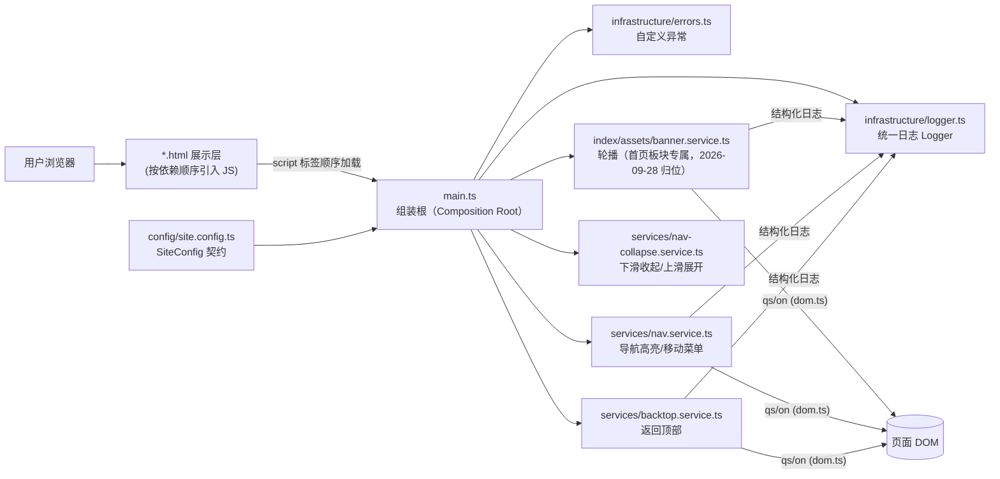

# Phase 1 · 架构设计与接口契约（前端门户，历史文档）

> **说明**：本文档记录的是**前端门户**（纯静态阶段）的架构与契约，内容仍然有效；
> 全站总体架构（服务器部署、后端 API、演进路线）以 [ARCHITECTURE.md](ARCHITECTURE.md) 为准。

> 依据 `agent.md` Rule 3「契约先行两阶段法」产出。Phase 2 仅在本文档获得确认后启动。

## 1. 架构定位与数据流

### 1.1 系统定位

本项目为**清华大学水木书院学生科学技术协会官网**，纯静态站点（HTML/CSS/JS，零构建依赖），内容架构参照电子系科协文档站（eesast/docs），视觉与语言风格严格遵循水木书院官网（smc.tsinghua.edu.cn，清华紫 `#660874`（PANTONE 259C）+ 渐变辅助玫红 `#D93379`）。

站点定位为「展示 + 导航」型门户：首页承担书院门户式版面（横幅、新闻/公告），四个资料板块页（编程语言介绍 / 开发工具 / Web 开发 / 学校资源）为占位页，内容后续由科协成员补充；关于我们页承载科协简介，用户/管理员账号体系与轮播管理页见 [ARCHITECTURE.md](ARCHITECTURE.md) §9。

### 1.2 分层映射（Rule 2 对静态站点的适配）

| 分层 | 本项目载体 | 职责 |
| :--- | :--- | :--- |
| 展示层 Presentation | `*.html` + `assets/css/*` | 页面结构、视觉样式，零业务逻辑 |
| 业务行为层 Service | `assets/js/services/*` | 页面交互行为（轮播、导航状态、返回顶部） |
| 基础设施层 Infrastructure | `assets/js/infrastructure/*` | 横切能力：统一日志、DOM 查询/事件工具、自定义错误 |
| 配置层 Config | `assets/js/config/site.config.ts` | 站点唯一配置源（零硬编码：轮播间隔、日志级别等经此注入） |

### 1.3 核心数据流



模块通信约定：使用经典 `<script>`（兼容 `file://` 直开），各模块挂载于单一全局命名空间 `window.SMSK`（水木科协 Shuimu Science & technology assoCiation）；服务一律为**工厂函数**，依赖经参数注入（DI），禁止服务内部读取全局配置。

## 2. 模块目录结构

```
shuimu-web/
├── agent.md                       # 主协议（用户维护）
├── README.md                      # 项目说明与内容补充指南
├── docs/
│   └── PHASE1-架构设计.md          # 本文档
├── tests/
│   └── selftest.html              # 纯函数轻量自测页（浏览器原生断言，零依赖）
└── site/                          # 站点部署单元（页面与资源统一收拢于此）
    ├── index/                     # 首页板块（自包含：页面 + 专属脚本 + 专属数据）
    │   ├── index.html             #   首页（书院门户式版面）
    │   ├── assets/banner.service.ts   #   首页专属脚本：轮播服务
    │   └── data/banners.js        #   首页专属数据：轮播内容（后端读写，正常入库）
    ├── user/                      # 用户板块：signin.html / signup.html（裸页）
    │   └── assets/{auth,avatar,signin,signup}.ts  # 全站登录态 / 头像 / 两个表单脚本
    ├── administrator/index.html   # 管理员登录页（深色控制台，独立工具页）
    │   └── assets/administrator.ts    #   管理员登录表单脚本
    ├── admin/index.html           # 轮播管理页（需管理员登录）
    │   └── assets/admin.ts        #   管理页脚本（表单 ↔ PUT /api/banners）
    ├── languages/index.html       # 编程语言 Languages（占位页）
    ├── tools/index.html           # 开发工具 Tools（占位页）
    ├── web/index.html             # Web 开发 Web（占位页）
    ├── essentials/index.html      # 学校资源 School Resources（占位页）
    ├── about/index.html           # 关于我们 About Us（科协简介）
    ├── tsconfig.json              # 前端 TS 编译配置（strict，原位产出 .js）
    └── assets/                    # 全站共享资源（板块私有资源放各板块文件夹）
        ├── css/                   # 样式层（板块同名文件夹 + common 公用）
        │   ├── common/            #   公用：base / layout / footer / subpage
        │   ├── index/             #   首页板块：index.css（轮播/新闻公告）
        │   ├── user/              #   用户板块：user.css（登录/注册裸页卡片）
        │   ├── administrator/     #   管理员板块：administrator.css（深色控制台）
        │   ├── admin/             #   管理页板块：admin.css（自内联抽出）
        │   ├── about/             #   关于我们板块：about.css（简介双栏/统计卡）
        │   └── languages|tools|web|essentials/   # 四个资料板块：同名 css（空占位）
        └── js/                    # 公用行为层：TS 源码入库，编译产物 .js 不入库
            ├── types.d.ts         #   类型层：window.SMSK 命名空间与共享契约声明
            ├── config/site.config.ts  #   配置层：SiteConfig 契约唯一实现
            ├── infrastructure/    #   logger / dom / errors（横切工具与自定义异常）
            ├── services/          #   nav / nav-collapse / topbar / backtop
            └── main.ts            #   组装根：读配置 → 建 Logger → 装配并启动服务
```

> 说明：收到协议前产出的 `assets/css/style.css` 草稿已在 Phase 2 拆分为上述样式模块；
> 2026-09-28 起样式按板块归入 `css/common/` + `css/<板块>/`，2026-09-29 起取消单文件
> 行数上限（不为拆而拆，见 `agent.md` Rule 2 §3），旧文件已删除。
> **目录现状的权威描述见 [ARCHITECTURE.md](ARCHITECTURE.md) §3，本文档目录树仅保留板块划分语义。**

## 3. 核心实体与接口契约

静态站点无编译期类型，采用 **JSDoc typedef** 作为强类型契约（编辑器可静态检查）。

### 3.1 配置实体（config 层）

```js
/**
 * BannerConfig —— 轮播配置契约
 * @typedef {Object} BannerConfig
 * @property {number}  intervalMs   自动播放间隔（毫秒），如 5000
 * @property {boolean} autoplay     是否自动播放
 */

/**
 * SiteConfig —— 站点全局配置契约（唯一配置源，零硬编码）
 * @typedef {Object} SiteConfig
 * @property {'debug'|'info'|'warn'|'error'} logLevel 日志级别
 * @property {BannerConfig} banner
 * @property {number} backtopThresholdPx  返回顶部按钮显隐滚动阈值（像素）
 */
```

### 3.2 基础设施接口（infrastructure 层）

```js
/**
 * Logger —— 统一日志器契约（禁用原生 console 输出的替代方案）
 * @typedef {Object} Logger
 * @property {(scope: string, msg: string, ctx?: Object): void} info
 * @property {(scope: string, msg: string, ctx?: Object): void} warn
 * @property {(scope: string, msg: string, err?: Error): void} error  // 附上下文与堆栈
 * @property {(scope: string, msg: string, ctx?: Object): void} debug  // 生产级别下静默
 */

/** createLogger —— Logger 工厂
 * @param {'debug'|'info'|'warn'|'error'} minLevel 生效的最低日志级别
 * @returns {Logger}
 */

/** qs —— 查询首个匹配元素（DOM 工具，纯函数）
 * @param {string} sel        CSS 选择器
 * @param {ParentNode} [scope] 查询范围，默认 document
 * @returns {HTMLElement|null}
 */

/** on —— 事件绑定（返回解绑函数，便于服务 destroy）
 * @param {EventTarget} target
 * @param {string} type
 * @param {(ev: Event) => void} handler
 * @returns {() => void} 解绑函数
 */
```

### 3.3 自定义异常（errors.ts）

```js
/** ConfigError：配置契约违反（缺字段/非法枚举值），携带字段名与实际值上下文 */
/** DomError：关键 DOM 节点缺失，携带选择器与所在页面上下文 */
```

### 3.4 服务接口（services 层，均为 DI 工厂）

```js
/**
 * createBannerService —— 首页轮播服务（2026-09-29 契约补全：数据改为经参数注入）
 * @param {HTMLElement|null} root     轮播根节点（.banner）；非首页为 null，直接空实现
 * @param {BannerConfig}    config    轮播配置
 * @param {Logger}          logger    统一日志器
 * @param {unknown}         slides    轮播数据（来自 index/data/banners.js，按不可信输入校验）
 * @returns {{ start(): void, destroy(): void }}
 * 行为：按数据渲染幻灯片并切换 .slide.active 与指示点（s1/s2/s3 底色按序自动轮换）；
 *       nextIndex(current, total) 与 validateBannerSlides(input) 为导出纯函数供自测；
 *       配置或数据契约违约时抛 ConfigError（带字段路径），不静默降级。
 */

/**
 * createNavService —— 导航服务
 * @param {HTMLElement}   navEl     主导航 <ul> 节点
 * @param {string}        pageId    当前页面标识（取自 <body data-page>）
 * @param {Logger}        logger
 * @returns {{ highlight(): void, bindMobileToggle(): void }}
 * 行为：按 <body data-page> 直接高亮对应 <li data-page>（2026-09-28 移除
 *      运行时未使用的 resolveActivePage 纯函数及其 NavItem 契约）
 */

/**
 * createBacktopService —— 返回顶部服务
 * @param {HTMLElement|null} btn       返回顶部按钮；缺失时空实现并 warn
 * @param {number}           thresholdPx 显隐滚动阈值
 * @param {Logger}           logger
 * @returns {{ start(): void, destroy(): void }}
 */
```

### 3.5 组装根（main.ts）

```js
/** bootstrap —— 读 SiteConfig → createLogger → 依页面标识装配所需服务并启动
 * Globals Used: window.SMSK.CONFIG（配置层注入）、document（DOM 根）
 * Calls: createLogger / createBannerService / createNavService / createBacktopService
 */
```

## 4. 全局基线落地（Rule 1 / Rule 2）

1. **文档注释**：所有 JS 文件顶部标注模块职责与加载依赖顺序；每个工厂/纯函数按契约格式注释（职责 / Globals Used / Calls / Args / Returns）。
2. **文件与函数尺寸**：（2026-09-28 起按新协议取消行数上限，不为拆而拆；
   首页样式已由 4 文件合并回 `css/index/index.css`。）
3. **零硬编码**：轮播间隔、日志级别、滚动阈值等全部经 `site.config.ts` 注入。
4. **日志**：全程使用 `Logger`（info/warn/error 语义化），页面生命周期关键节点输出 INFO。
5. **错误处理**：配置缺失、关键 DOM 缺失抛自定义异常并附上下文，不静默吞错。
6. **纯逻辑可测**：`nextIndex`、`resolveNavState`、`validateBannerSlides` 独立导出，
   `tests/selftest.html` 以浏览器原生断言覆盖边界（空列表/越界/契约违约等）。

## 5. Phase 2 交付清单（确认后执行）

1. 样式模块（紫色书院门户风；2026-09-28 已按新规则合并精简）。
2. 按契约实现 config / infrastructure / services / main.ts（2026-09-27 起为 TypeScript 源码，编译产物 .js 不入库）。
3. 首页 `index.html` + 板块占位页（同头部导航/页脚，占位卡片 + 主题标签；
   2026-09-28 精简为首页 + 四个资料板块页，另加关于我们与账号/管理页）。
4. `tests/selftest.html` 纯函数自测；本地起服务验证渲染并截图自检。
5. `README.md`：目录说明、本地预览方式、后续内容补充指南。
